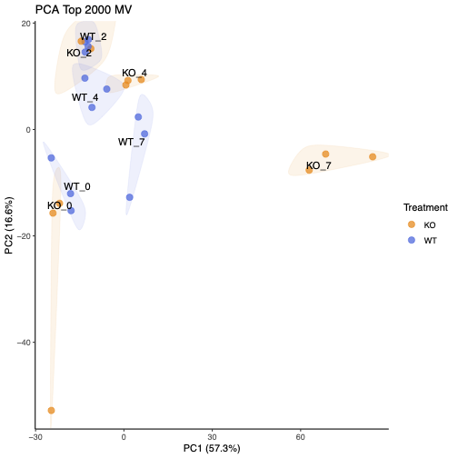
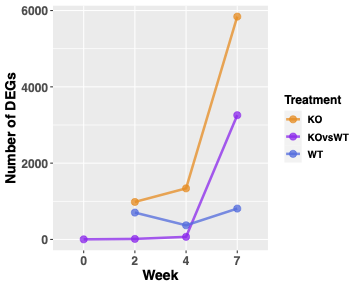
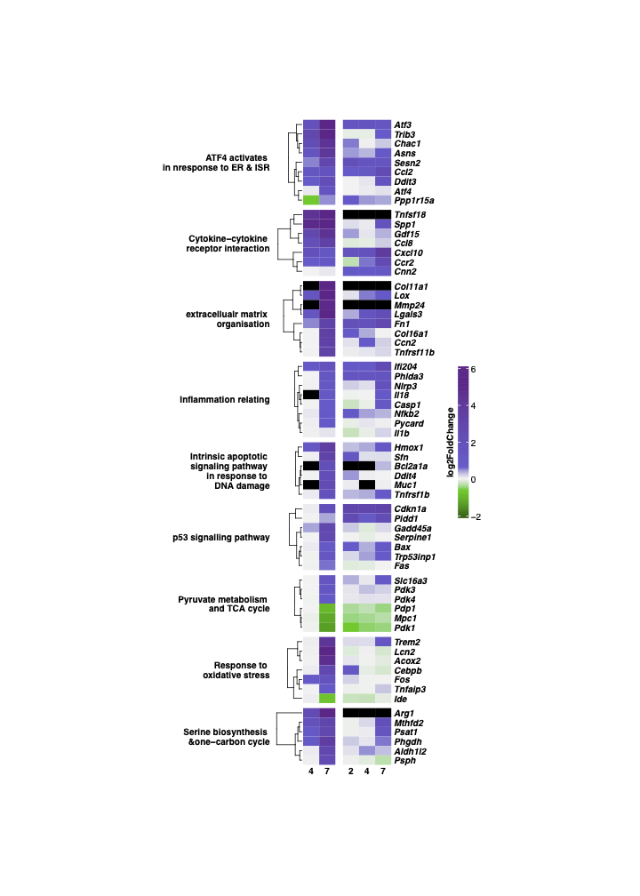
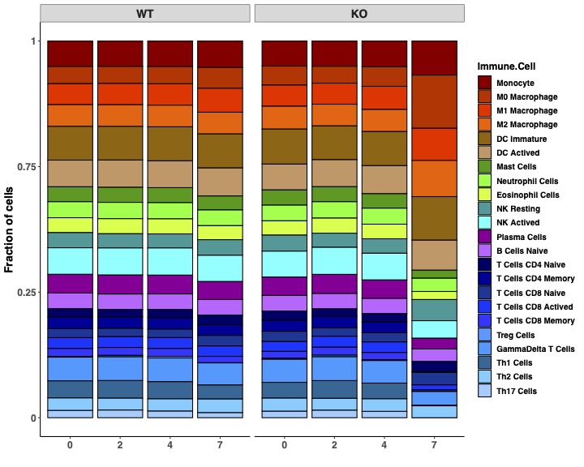
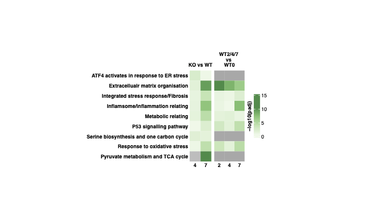

# Takaoka_Mallat_Goodall
## GDF15 antagonism limits severe heart failure and prevents cardiac cachexia in mice


Minoru Takaoka<sup>1 </sup>, Xiaohui Zhao<sup>1</sup>, John A.Tadross<sup>2,3</sup>, Ali Al-Hadithi<sup>1</sup>, Rocío Villena-Gutiérrez<sup>4</sup>, Jasper Tromp<sup>5,6</sup>, Shazia Absar<sup>1</sup>, Marcus Au<sup>1</sup>, James Harrison<sup>1</sup>, Anthony, P. Coll<sup>2</sup>, Stefan J. Marciniak<sup>7</sup>, Debra Rimmington<sup>2</sup>, Eduardo Oliver <sup>4,8,9 </sup>, Borja Ibáñez <sup>4,8,10 </sup>, Adriaan, A. Voors <sup>5 </sup>, Stephen O’Rahilly <sup>2 </sup>, Ziad Mallat <sup>1,11\* </sup> and Jane C. Goodall<sup>1\* †</sup> <br>

<sup>1</sup> Victor Phillip Dahdaleh Heart and Lung Research Institute. Department of Medicine, University of Cambridge, Cambridge, UK <br>
<sup>2</sup> Wellcome-MRC Institute of Metabolic Science and Medical Research Council, Metabolic Diseases Unit, University of Cambridge, Cambridge, UK <br>
<sup>3</sup> Department of Histopathology and East Midlands & East of England Genomic Laboratory  <br>
<sup>4</sup> Centro Nacional de Investigaciones Cardiovasculares (CNIC), Madrid. Spain.<br>
<sup>5</sup> University of Groningen, University Medical centre Groningen, the Netherlands<br>
<sup>6</sup> National Heart Centre Singapore, Singapore<br>
<sup>7</sup> Cambridge Institute for Medical Research, Cambridge Biomedical Campus, University of Cambridge, Cambridge, UK<br>
<sup>8</sup> Centro de Investigaciones Biomédicas en Red de Enfermedades Cardiovasculares (CIBERCV), Madrid. Spain<br>
<sup>9</sup> Centro de Investigaciones Biologicas Margarita Salas (CIB-CSIC), Madrid, Spain.<br>
<sup>10</sup> IIS-Hospital Fundacion Jimenez Diaz, Madrid, Spain<br>
<sup>11</sup> Paris Cardiovascular Research Center, Université Paris Cité, INSERM UMRS 970, Paris, France.<br>

\* Co-senior authors. <br>
†Corresponding authors: Jane C. Goodall. Heart and Lung Research Institute. Department of Medicine, University of Cambridge, Cambridge, UK. +441223763977. jcg23@medschl.cam.ac.uk

## Abstract
**Aims** <br>
Heart failure and associated cachexia is an unresolved and important problem. This study aimed to determine the factors that contribute to cardiac cachexia in a new model of heart failure in mice that lack the integrated stress response (ISR) induced eIF2 phosphatase, PPP1R15A. <br>
**Methods and results**<br>
Mice were irradiated and reconstituted with bone marrow cells. Mice lacking functional PPP1R15A, exhibited dilated cardiomyopathy and severe weight loss following irradiation, whilst wild-type mice were unaffected. This was associated with increased expression of Gdf15 in the heart and increased levels of GDF15 in circulation. We provide evidence that the blockade of GDF15 activity prevents cachexia and slows the progression of heart failure. We also show the relevance of GDF15 to lean mass and protein intake in patients with heart failure.<br>
**Conclusion** <br>
Our data suggest that cardiac stress mediates a GDF15-dependent pathway that drives weight loss and worsens cardiac function. Blockade of GDF15 could constitute a novel therapeutic option to limit cardiac cachexia and improve clinical outcomes in patients with severe systolic heart failure. <br>

**Keywords:** Heart Failure, GDF15, PPP1R15a, cachexia, Integrated stress response


## SampleTable
SampleName      |   Condition          |WeeksPI|  Time | Replicates| Gender| SampleID|
--------        |  --------------------|--------------| --------|------|------|------|
GTC251-1-42.2d	|WT	|Non-irradiated	|0w	|1|Female|WT_T0w_REP1|
GTC251-2-42.2f	|WT	|Non-irradiated	|0w	|2|Female|WT_T0w_REP2|
GTC251-3-42.2g	|WT	|Non-irradiated	|0w	|3|Female|WT_T0w_REP3|
GTC251-4-32.2d	|KO	|Non-irradiated	|0w	|1|Female|KO_T0w_REP1|
GTC251-5-38.2d	|KO	|Non-irradiated	|0w	|2|Female|KO_T0w_REP2|
GTC251-6-32.2f	|KO	|Non-irradiated	|0w	|3|Female|KO_T0w_REP3|
GTC251-7-42.1f	|WT	|2 weeks	|2w	|1|Female|WT_T2w_REP1|
GTC251-8-42.1g	|WT	|2 weeks	|2w	|2|Female|WT_T2w_REP2|
GTC251-9-42.1h	|WT	|2 weeks	|2w	|3|Female|WT_T2w_REP3|
GTC251-10-35.1e	|WT	|2 weeks	|2w	|4|Female|WT_T2w_REP4|
GTC251-11-38.1c	|KO	|2 weeks	|2w	|1|Female|KO_T2w_REP1|
GTC251-12-37.1c	|KO	|2 weeks	|2w	|2|Female|KO_T2w_REP2|
GTC251-13-44.1c	|WT	|4 weeks	|4w	|1|Female|WT_T4w_REP1|
GTC251-14-44.1d	|WT	|4 weeks	|4w	|2|Female|WT_T4w_REP2|
GTC251-15-44.1e	|WT	|4 weeks	|4w	|3|Female|WT_T4w_REP3|
GTC251-16-32.1g	|KO	|4 weeks	|4w	|1|Female|KO_T4w_REP1|
GTC251-17-32.1i	|KO	|4 weeks	|4w	|2|Female|KO_T4w_REP2|
GTC251-18-32.1j	|KO	|4 weeks	|4w	|3|Female|KO_T4w_REP3|
GTC251-19-30.1i	|WT	|7 weeks	|7w	|1|Female|WT_T7w_REP1|
GTC251-20-30.1j	|WT	|7 weeks	|7w	|2|Female|WT_T7w_REP2|
GTC251-21-29.1d	|WT	|7 weeks	|7w	|3|Male|WT_T7w_REP3|
GTC251-22-31.1d	|KO	|7 weeks	|7w	|1|Male|KO_T7w_REP1|
GTC251-23-31.1e	|KO	|7 weeks	|7w	|2|Female|KO_T7w_REP2|
GTC251-23-31.1e |KO	|7 weeks	|7w	|3|Male|KO_T7w_REP3|

## Data Availability (Need to complete the Data submission information)

* RNASeq data: EMBL-EBI ArrayExpress **E-MTAB-12831** (https://www.ebi.ac.uk/arrayexpress/experiments/E-MTAB-12831/)

## Methods:

RNAseq analysis
RNA-Seq, 50bp paired end, libraries were generated from defined time points (N=6 for each time point, Supplementary Table 1) with different conditions (WT and KO). Raw fastq data have been deposited in ArrayExpress with accession number E-MTAB-12831(https://www.ebi.ac.uk/biostudies/arrayexpress/studies/E-MTAB-12831).

For each library, original reads files were aligned to GRCm39 mouse genome (Ensembl Release) with STAR (v2.6.1d)<sup>1</sup>. Alignments and quality control (QC) were processed using a nextflow (v21.05.0.edge)<sup>2</sup> pipeline nf-core/rnaseq (v3.2)<sup>3</sup> with ‘star_salmon’ option. QC reports were assessed using MultiQC (v1.12)<sup>4</sup>, which includes output from FastQC (v0.11.9)<sup>5</sup> and Trim_galore (v0.6.6)<sup>6</sup>. Gene quantification was determined with featureCounts in subread (v2.0.1)<sup>7</sup>. The alignment results are with a mean of 73.24% reads uniquely mapping and mean of 18.52M reads per sample (Supplementary Table 1). Corresponding software/packages and versions are listed in Supplementary Table 2. All scripts, with details of software versions, expression raw count files and results are freely available from https://github.com/CAD-ZM-BFX/Takaoka_Mallat_Godall (DOI:xxxx).

Differential gene expression (DGE) analysis was performed with DESeq2 (v1.38.3, R version4.2.1)<sup>8,9</sup>. All samples normalised counts was listed in Supplementary Table 3. Significant differential expressed genes (DEGs) were listed in Supplementary Table 4-8 for different comparisons as interested. These DEGs were selected using the threshold for Benjamini-Hochberg (BH) adjusted p-value less than 0.05 and absolute log2FoldChange greater than 0.6 (1.5-fold changes). Principal component analysis (PCA) for all samples was performed with the top 2000 most variable genes were selected to the plot (Fig xx).

The above selected significant DEGs were applied as input for the Gene Ontology (GO), Kyoto Encyclopedia of Genes and Genomes (KEGG) and Reactome pathway enrichment analysis. Based on our main interest is to compare the different conditions under different timepoints functional differences, “compareCluster” function is applied to these significant DEGs lists under R package “ClusterProfiler”(version4.6.2)<sup>10,11</sup>. All identified pathways are listed in Supplementary Table 9-14, with 9 selected pathways and corresponding genes plotted in Figure 2c and SFig2g using R package “complexHeatmap’’ (version2.14.0)<sup>12,13</sup>.

RNASeq deconvolution analysis was performed. Samples were deconvolved for fractions of the immunecell types present, using DeconRNASeq (version 1.40.0)<sup>14</sup> and a reference signature matrix that distin-guishes 25 mouse hematopoietic cell types (srep40508-s1.csv)<sup>14</sup>, including six major cell types: granulocytes, B cells, T cells, natural killer cells, dendritic cells, and mono/macro-phages. (see Figure 2d)

Transcription factor analysis applied to post time week 7 after irradiated using “decoupleR” package in (R, version 2.4.0)<sup>15</sup>. (Supplementary Table 15 and Figxx).

Data availability
All the associated raw data presented in this paper are available from the corresponding author upon reasonable request. Source data are provided with this paper.
Raw RNA-sequencing data is accessible through the EMBL-EBI ArrayExpress with accession number E-MTAB-12831. (https://www.ebi.ac.uk/biostudies/arrayexpress/studies/E-MTAB-12831)

Code availability
Custom codes for RNA-sequencing analysis used in this paper are available on on Github (https://github.com/ https://github.com/CAD-ZM-BFX/Takaoka_Mallat_Godall, DOI:xxxxxxx).


References:
1.	Dobin A, Davis CA, Schlesinger F, Drenkow J, Zaleski C, Jha S, Batut P, Chaisson M, Gingeras TR. STAR: ultrafast universal RNA-seq aligner. Bioinformatics. 2013 Jan 1;29(1):15-21. doi: 10.1093/bioinformatics/bts635. Epub 2012 Oct 25. PMID: 23104886; PMCID: PMC3530905.
2.	 P. Di Tommaso, et al. Nextflow enables reproducible computational workflows. Nature Biotechnology 35, 316–319 (2017) doi:10.1038/nbt.3820
3.	Ewels, P.A., Peltzer, A., Fillinger, S. et al. The nf-core framework for community-curated bioinformatics pipelines. Nat Biotechnol 38, 276–278 (2020). https://doi.org/10.1038/s41587-020-0439-x
4.	Philip Ewels, Måns Magnusson, Sverker Lundin and Max Käller. MultiQC: Summarize analysis results for multiple tools and samples in a single report. Bioinformatics (2016) 10.1093/bioinformatics/btw354
5.	Andrews, S. (2010). FastQC:  A Quality Control Tool for High Throughput Sequence Data [Online]. Available online at: http://www.bioinformatics.babraham.ac.uk/projects/fastqc/
6.	Felix Krueger (Trim Galore) A wrapper tool around Cutadapt and FastQC to consistently apply quality and adapter trimming to FastQ files, with some extra functionality for MspI-digested RRBS-type (Reduced Representation Bisufite-Seq) libraries. [online]: https://www.bioinformatics.babraham.ac.uk/projects/trim_galore/
7.	Liao Y, Smyth GK and Shi W. featureCounts: an efficient general-purpose program for assigning sequence reads to genomic features. Bioinformatics, 30(7):923-30, 2014
8.	R Core Team (2020). R: A language and environment for statistical computing. R Foundation for Statistical Computing, Vienna, Austria. URL https://www.R-project.org/.
9.	Love MI, Huber W, Anders S (2014). “Moderated estimation of fold change and dispersion for RNA-seq data with DESeq2.” Genome Biology, 15, 550. doi: 10.1186/s13059-014-0550-8.
10.	 Yu G, Wang L, Han Y, He Q (2012). “clusterProfiler: an R package for comparing biological themes among gene clusters.” OMICS: A Journal of Integrative Biology, 16(5), 284-287. doi: 10.1089/omi.2011.0118.
11.	Wu T, Hu E, Xu S, Chen M, Guo P, Dai Z, Feng T, Zhou L, Tang W, Zhan L, Fu x, Liu S, Bo X, Yu G (2021). “clusterProfiler 4.0: A universal enrichment tool for interpreting omics data.” The Innovation, 2(3), 100141. doi: 10.1016/j.xinn.2021.100141.
12.	Gu Z, Eils R, Schlesner M (2016). “Complex heatmaps reveal patterns and correlations in multidimensional genomic data.” Bioinformatics. doi:10.1093/bioinformatics/btw313.
13.	Gu Z (2022). “Complex Heatmap Visualization.” iMeta. doi:10.1002/imt2.43.
14.	Y. Chenet al., Inference of immune cell composition on the expression profiles of mouse tissue. Scientific Report. 7, 40508 (2017).
15.	Badia-i-Mompel P., Vélez Santiago J., Braunger J., Geiss C., Dimitrov D., Müller-Dott S., Taus P., Dugourd A., Holland C.H., Ramirez Flores R.O. and Saez-Rodriguez J. 2022. decoupleR: Ensemble of computational methods to infer biological activities from omics data. Bioinformatics Advances. https://doi.org/10.1093/bioadv/vbac016


## Raw fastqs to count matrix pipeline

nextflow (version 21.05.0.edge) nf-core/rnaseq (version 3.2) "star_salmon" pipeline. <br>

**The script of sampleTable generating to Nextflow input is** <br>

CAD_jcg23_0001-SampleTable_Generate.R [[R](Scripts/CAD_jcg23_0001-SampleTable_Generate.R)] <br>

**And the sample table input is given as below link.** <br>

CAD_jcg23_0001-nextflow_SampleTable.csv [[CSV](CAD_jcg23_0001-nextflow_SampleTable.csv)]

**The command of the nextflow running is**

```shell

 ```
**Software Versions in nextflow (nf-core/rnaseq):** <br>
see Supplementary_Data_Oct_2023.xlsx[[XLSX](Figures_Tables/Supplementary_Data_Oct_2023.xlsx)], *STable2*.

## DESeq2 + GeneOntology Analysis Results
Differential analysis are performed as below: <br>

1) Each time point: KO vs WT; <br>
2) WT: wk2 vs wk0, wk4 vs wk0 and wk7 vs wk0 <br>

### Figures Summary links

CAD_jcg23_0001-DESeq_Analysis_modified_Nov_2022.R[[Rscript](Scripts/CAD_jcg23_0001-DESeq_Analysis_modified_Nov_2022.R)]

| Figures       | Downloads            |Image         | Legend (Corresponding Fig)|
--------        |  --------------------|--------------| ------------------------  |
SuppFigxx-Cust_PCA_allSamples_April_2023_withoutPath.pdf | [[PDF](Figures_Tables/SuppFigxx-Cust_PCA_allSamples_April_2023_withoutPath.pdf)]| | PCA plot shows top 2000 variable genes clustering of different time points together with either KO or WT  analysed by RNA-Seq. |
SuppFigxx-Comparing_Numbers_DEGs_with_time_April_2023.pdf | [[PDF](Figures_Tables/SuppFigxx-Comparing_Numbers_DEGs_with_time_April_2023.pdf)]| | Line dot plot to show the number of DEGs identified with different comparisons.|
Fig2c_SFig2g-SelPathways_genes_heatmap.pdf | [[PDF](Figures_Tables/Fig2c_SFig2g-SelPathways_genes_heatmap.pdf)]| | Selected genes foldchanges  relating to corresponding pathways heatmap across different comparison.|
Fig2d-DESeq2_ImmuneCellTypeDeconvolution_stacked_barplot.pdf | [[PDF](Figures_Tables/Fig2d-DESeq2_ImmuneCellTypeDeconvolution_stacked_barplot.pdf)]| | RNA deconvolution stacked bar plot.|
Figxx-Pathways_Heatmap_KOvsWT_WT_avgP_25_April_2023.pdf | [[PDF](Figures_Tables/Figxx-Pathways_Heatmap_KOvsWT_WT_avgP_25_April_2023.pdf)]| |selected pathways heatmap plot with padjusted value in each comparisons.|


### All tables have been merged to a xlsx file and method below
Supplementary_Data_Oct_2023.xlsx [[XLSX](Figures_Tables/Supplementary_Data_Oct_2023.xlsx)]

| Table Index       | Legend           |
--------       |  --------------------|
**General Information** | |
STable1|Sample table input summary with mapping statistics.|
STable2|Nextflow softwares and corresponding versions|
**DEGs list**||
STable3|Normalised counts for all samples with all identified genes using DESeq2 median of ratios normalisation (counts divided by sample-specific size factors determined by median ratio of gene counts relative to geometric mean per gene). |
STable4|List of 118 significant differentially expressed genes (DEGs) identified using DESeq2 by comparing post week 4 after irradiated between KO and WT (each has 3 replicates). The threshold cut-off for significance is padj (Benjamini-Hochberg correction) < 0.05 & abs(log2FoldChange) >= 0.6 (equals 1.5-fold change). This list is also applied to GeneOntology analysis as input.|
STable5|List of 5070 significant differentially expressed genes (DEGs) identified using DESeq2 by comparing post week 7 after irradiated between KO and WT (each has 3 replicates). The threshold cut-off for significance is padj (Benjamini-Hochberg correction) < 0.05 & abs(log2FoldChange) >= 0.6 (equals 1.5-fold change). This list is also applied to GeneOntology analysis as input.|
STable6|List of 1812 significant differentially expressed genes (DEGs) identified using DESeq2 by comparing post week 2 to  nonirradiated wk0 WT (wk2 4 replicates vs wk0 3 replicates). The threshold cut-off for significance is padj (Benjamini-Hochberg correction) < 0.05 & abs(log2FoldChange) >= 0.6 (equals 1.5-fold change). This list is also applied to GeneOntology analysis as input.|
STable7|List of 994 significant differentially expressed genes (DEGs) identified using DESeq2 by comparing post week 4 to  nonirradiated wk0 WT ( 3 replicates each). The threshold cut-off for significance is padj (Benjamini-Hochberg correction) < 0.05 & abs(log2FoldChange) >= 0.6 (equals 1.5-fold change). This list is also applied to GeneOntology analysis as input.|
STable8|List of 1726 significant differentially expressed genes (DEGs) identified using DESeq2 by comparing post week 7 to  nonirradiated wk0 WT ( 3 replicates each). The threshold cut-off for significance is padj (Benjamini-Hochberg correction) < 0.05 & abs(log2FoldChange) >= 0.6 (equals 1.5-fold change). This list is also applied to GeneOntology analysis as input.|
**GeneOntology**||
STable9|GeneOntology (Biological Process) enrichment comparison analysis using ClusterProfiler (R packages) "compareCluster" function compare wk4 (KOvsWT) and wk7(KOvsWT). Input list used STable4,5.|
STable10| Reactome pathway enrichment comparison analysis using ClusterProfiler (R packages) "compareCluster" function to compare wk4 (KOvsWT) and wk7(KOvsWT). Input list used STable4,5.|
STable11|KEGG pathway enrichment comparison analysis using ClusterProfiler (R packages) "compareCluster" function to compare wk4 (KOvsWT) and wk7(KOvsWT). Input list used STable4,5.|
STable12|GeneOntology  (Biological Process)  enrichment comparison analysis using ClusterProfiler (R packages) "compareCluster" function to compare WT wk2vswk0 wk4vswk0 and wk7vswk0. Input list used STable6,7,8.|
STable13|Reactome pathway enrichment comparison analysis using ClusterProfiler (R packages) "compareCluster" function to compare WT wk2vswk0 wk4vswk0 and wk7vswk0. Input list used STable6,7,8.|
STable14|KEGG pathway enrichment comparison analysis using ClusterProfiler (R packages) "compareCluster" function to compare WT wk2vswk0 wk4vswk0 and wk7vswk0. Input list used STable6,7,8.|
**Transcription Factor Analysis**||
STable15|Transcription Factor analysis for post week 7 after irradiate (KOvsWT) using R packages (decoupleR, OmnipathR). List of 66 significant TFs are selected. See Figxx for selected TFs barplot. |


## Software R Versions & Methods

````
R version 4.2.1 (2022-06-23)
Platform: x86_64-pc-linux-gnu (64-bit)
Running under: Ubuntu 16.04.7 LTS

Matrix products: default
BLAS:   /storage/Software/packages/R-4.0.2/lib/libRblas.so
LAPACK: /storage/Software/packages/R-4.0.2/lib/libRlapack.so

locale:
 [1] LC_CTYPE=en_GB.UTF-8       LC_NUMERIC=C              
 [3] LC_TIME=en_GB.UTF-8        LC_COLLATE=en_GB.UTF-8    
 [5] LC_MONETARY=en_GB.UTF-8    LC_MESSAGES=en_GB.UTF-8   
 [7] LC_PAPER=en_GB.UTF-8       LC_NAME=C                 
 [9] LC_ADDRESS=C               LC_TELEPHONE=C            
[11] LC_MEASUREMENT=en_GB.UTF-8 LC_IDENTIFICATION=C       

attached base packages:
 [1] grid      parallel  stats4    stats     graphics  grDevices utils    
 [8] datasets  methods   base     

other attached packages:
 [1] ComplexHeatmap_2.6.2        ggalt_0.4.0                
 [3] BiocParallel_1.24.1         ggbeeswarm_0.6.0           
 [5] scales_1.1.1                RColorBrewer_1.1-2         
 [7] pheatmap_1.0.12             ggforce_0.3.3              
 [9] biomaRt_2.47.9              DESeq2_1.30.1              
[11] SummarizedExperiment_1.20.0 Biobase_2.50.0             
[13] MatrixGenerics_1.2.1        GenomicRanges_1.42.0       
[15] GenomeInfoDb_1.26.7         IRanges_2.24.1             
[17] S4Vectors_0.28.1            BiocGenerics_0.36.1        
[19] reshape2_1.4.4              reshape_0.8.8              
[21] useful_1.2.6                matrixStats_0.58.0         
[23] Matrix_1.3-3                cowplot_1.1.1              
[25] ggrepel_0.9.1               ggplot2_3.3.3              
[27] dplyr_1.0.6                 tidyr_1.1.3                

loaded via a namespace (and not attached):
 [1] bitops_1.0-7           bit64_4.0.5            ash_1.0-15            
 [4] progress_1.2.2         httr_1.4.2             tools_4.0.2           
 [7] utf8_1.2.1             R6_2.5.0               KernSmooth_2.23-20    
[10] vipor_0.4.5            DBI_1.1.1              colorspace_2.0-1        
 .....           
````

## Contact

Contact Xiaohui Zhao (xz289 -at- cam.ac.uk)
